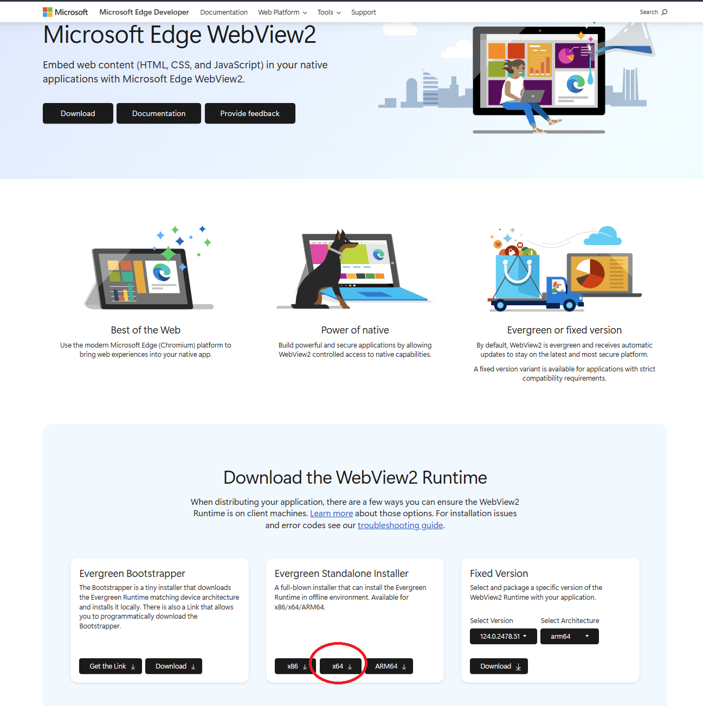
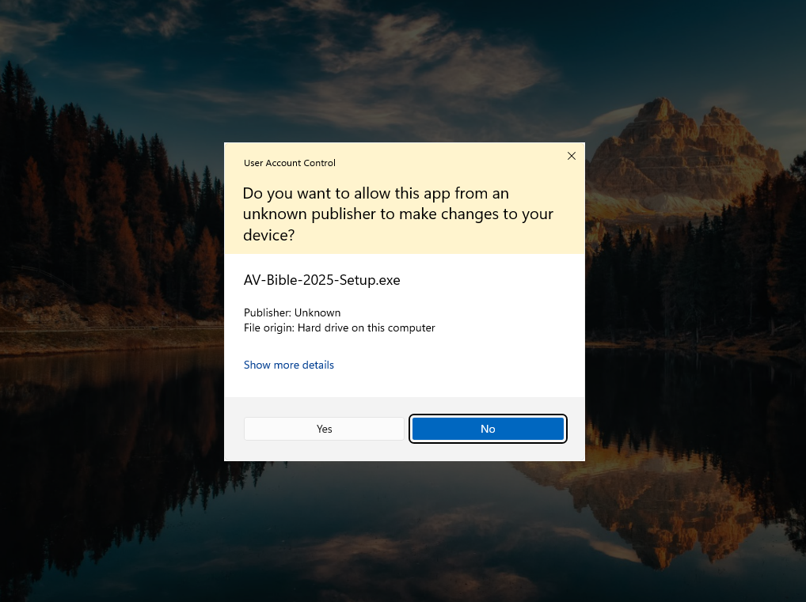

### These are instructions for installing Release-Candidate #2 of AV-Bible 2025

#### Requirements:

- Windows 11 (x64 -- System Type: 64-bit -- as revealed by \<System Information\> app, found via Windows Start-Menu)
- Microsoft-Store app/installer is in development, but additional capabilities may be available in this installer
- Early this year, this installer will provide the option of installing also an Addin for Microsoft Word

Here is a Microsoft thingie that unlocks some functionality of AV-Bible 2025, including the ability to view help files in the app:

https://developer.microsoft.com/en-us/microsoft-edge/webview2/ 

#### Two Prerequisites:

**Prerequisite A:**

Download and Install Microsoft .NET 8.0 Desktop Runtime (v8.0.11)

https://dotnet.microsoft.com/en-us/download/dotnet/thank-you/runtime-desktop-8.0.11-windows-x64-installer

**Prerequisite B:**

Install Microsoft WebView2, by going to https://developer.microsoft.com/en-us/microsoft-edge/webview2/ and scrolling down to "Evergreen Standalone Installer" (x64).

#### Setup Instructions:

**STEP #1:**

**1.a** - Download this setup program: 
https://github.com/kwonus/AVBible/raw/omega/Installation-Instructions/AV-Bible-2025-Setup.exe

**1.b** - Click on the downloads icon. Next click on the ellipses [ ... ] and click Keep

**1.c** - Click on the <u>Open File</u> link.

**1.d** - Click on Yes button:

**STEP #2:**

The program that you just installed is named "AV-Bible" and found in C:\Program Files\AV-Bible\AV-Bible.exe. An optional desktop icon can be added on the setup program above that simplifies program launch.

**Once it is running ...**

You should be able to view help files by clicking on the help menu pull-down:

#### Removal:

Should you want to delete this application, this can be accomplished using the standard Microsoft Windows Control Panel:

- Add or remove programs

AV Bible writes to your user-specific AppData folder. If your username were "JohnDoe", this folder would be named"C:\Users\JohnDoe\AV-Bible". This folder contains your search history, your macro definitions, and all AV-Bible program settings. That folder can be safely deleted if none of that information is of use to you.

Alternatively, that folder can be copied to new machines, should you want to capture it for an installations onto other computers.
